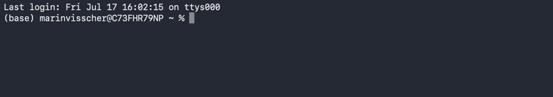

# What does Python do
In the beginning, computers were programmed manually. If a programmer wanted to automate something using a computer, they had to put all kinds of switches in the right order for the program to run and work.

Luckily, we live in a day and age where everything can be done digitally.

## Machine code and compiled languages
Computers only understand specific instructions. *Move this data here* or *Add this value and this value together*. The programmers that used to program in instructions like those were practically wizards. They would be able to deduce what the following program does just by looking at it:

```nasm
section .data
    message db "Hello, World!", 10
    length equ $ - message

section .text
    global _start

_start:
    ; write(stdout, message, length)
    mov rax, 1          ; syscall: write
    mov rdi, 1          ; file descriptor: stdout
    mov rsi, message    ; pointer to message
    mov rdx, length     ; message length
    syscall

    ; exit(0)
    mov rax, 60         ; syscall: exit
    xor rdi, rdi        ; exit code 0
    syscall
```

## How Python is different
Python is a programming language that is build on layers and layers of other programming code that takes care of all the details and boring stuff. Because of that, the code that was shown above in Assembly can be written in Python like this:

```Python
print("Hello World")
```

A single line of code is enough. This will show, or **return**, the phrase "Hello World" to the person that runs this bit of code.

That is in essence how Python works. You give it a line of code, Python:
1. **interprets** the code 
2. **returns** the outcome
3. **moves** to the next line of code

Thus, when you give it two lines of code, it will run the first, and then the second. This means if you write the following:

```Python
print("one")
print("two")
```
Python will return `one`, followed by `two`.

## Running Python code
There are many different ways to run, or **execute**, Python code. In this course we will get you acquainted with a few of them:
- By using Python directly
- By writing a Python script and running it
- By using Jupyter Notebooks

In preparation to this course you installed **Anaconda**, which is an overarching application to help you out with Python. If you managed to install Anaconda correctly, you can open Python by typing the following commands in your Command Prompt (Windows) or Terminal (MacOS):

```
conda activate base
python
```

If all went well, you should something similar to this:

```
Python 3.13.9 | packaged by Anaconda, Inc. | (main, Oct 21 2025, 19:11:29) [Clang 20.1.8 ] on darwin
Type "help", "copyright", "credits" or "license" for more information.
>>> 
```

Now you can type any Python code you want, and Python will run it. It is perfect for experimenting with smaller pieces of code that you don't necessarily want to save. You can always exit Python to return to your console by using the `exit()` command.

Try it out yourself with the **Hello World** example from above.



It is good to see this, because it is the basis of every Python program ever written. The Python interpreter goes over the code line by line and performs actions based on what's written. No matter whether you're using the interpreter directly, through a script, or through Jupyter Notebooks. This is the very core of any Python program.
